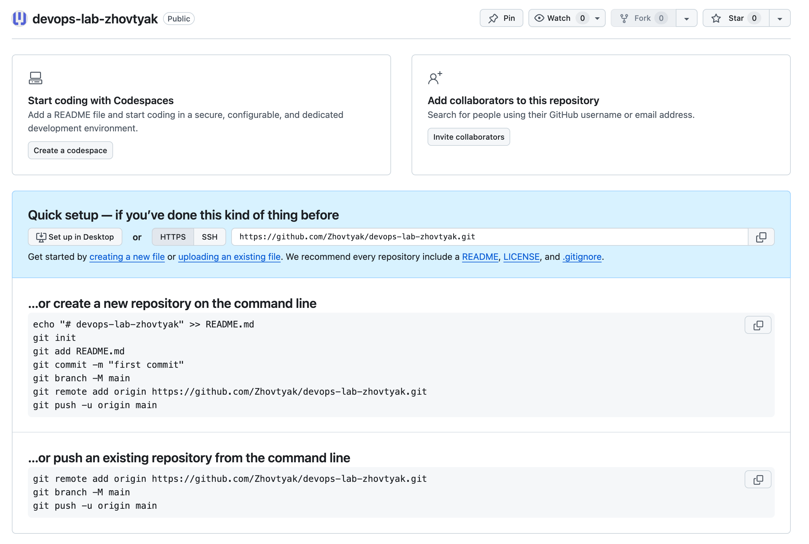
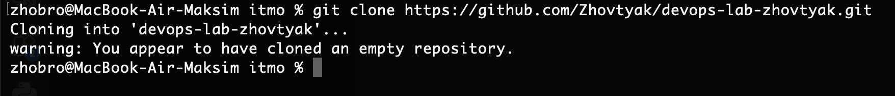
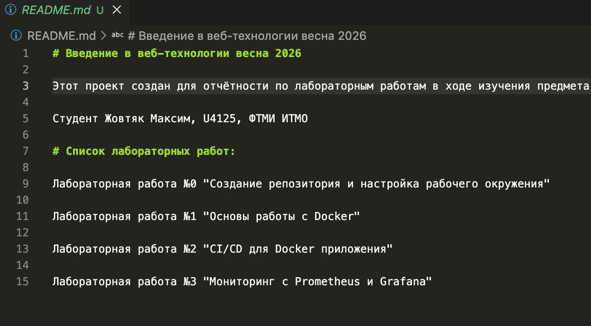
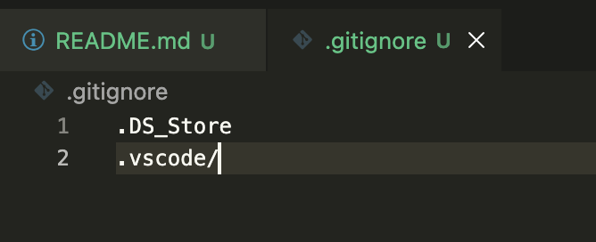
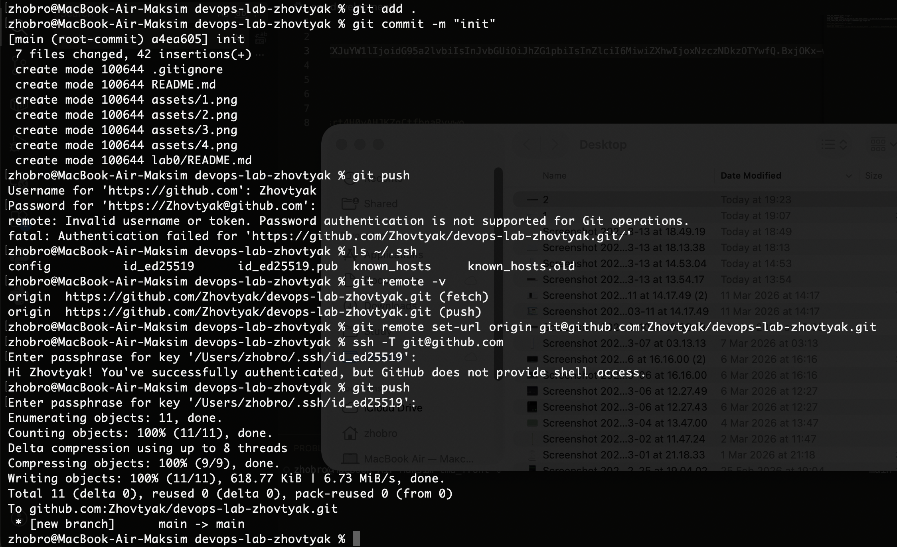
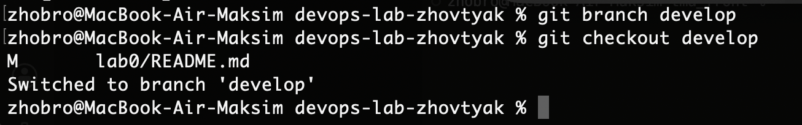
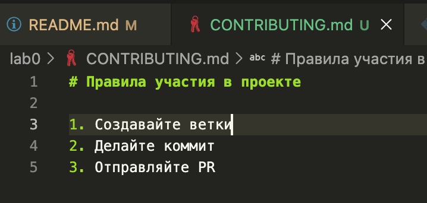

# Лабораторная работа №0 "Создание репозитория и настройка рабочего окружения"

### 1. Создаём репозиторий devops-lab-zhovtyak

  

### 2. Клонируем репозиторий локально на компьютер

  

### 3. Создаётся README.md файл для описания проекта

  

### 4. Создаётся минимальный .gitignore файл

  

### 5. Делаем коммит первый для инициализации проекта

  

### 6. Создаём ветку develop и переключаемся на неё

  

### 7. На ветке develop создаём файл CONTRIBUTING.md

  

### 8. Делаем коммит на develop ветке, делаем PR на main из неё, мёржим и удаляем develop

  

