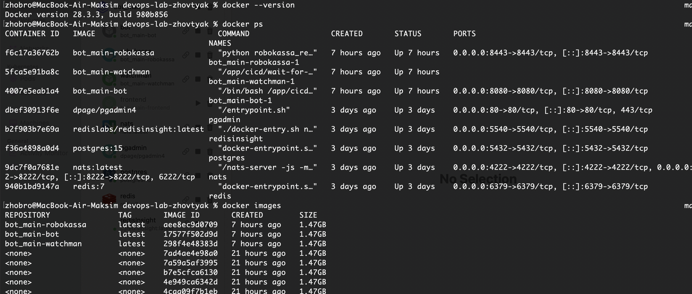
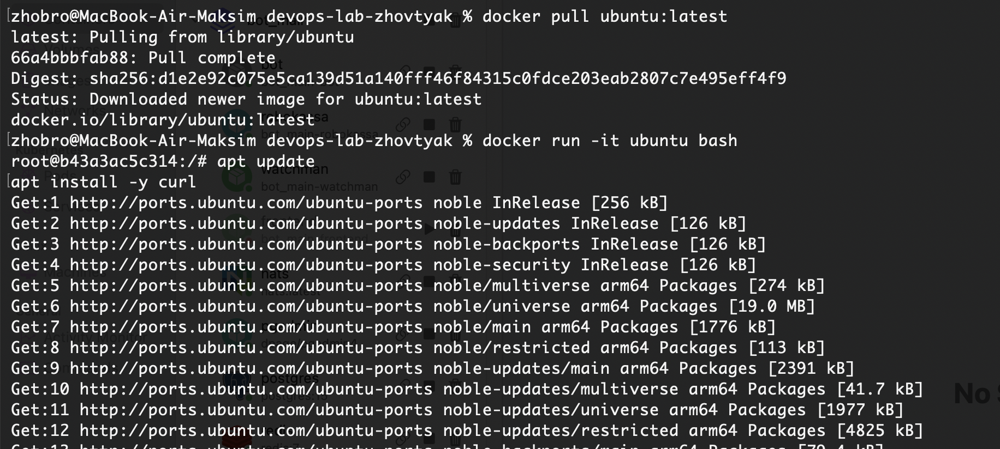
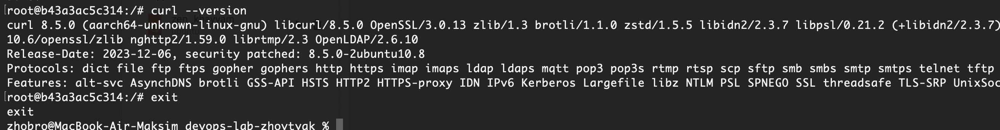
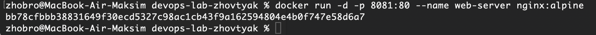
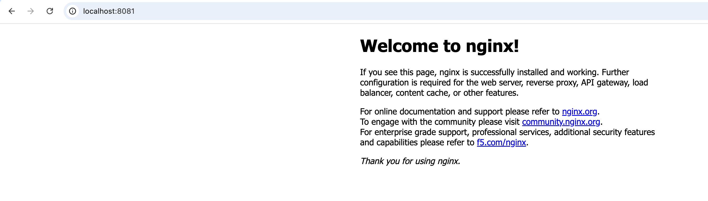
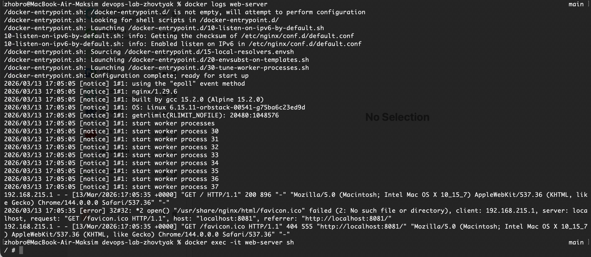
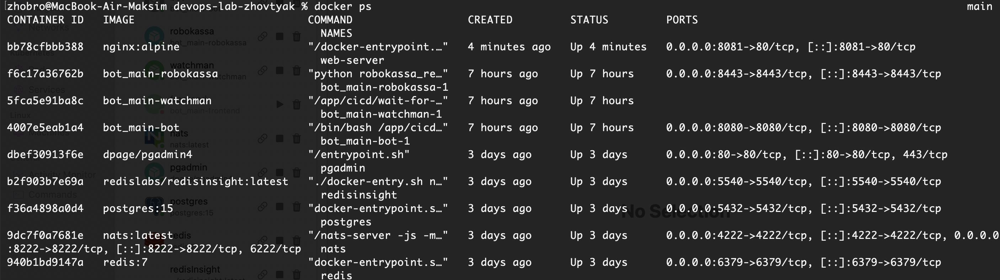
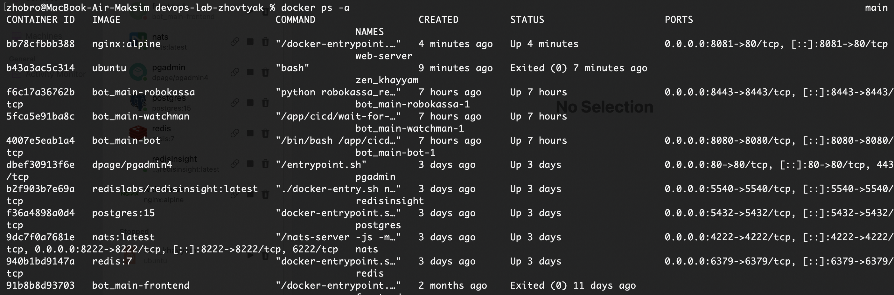
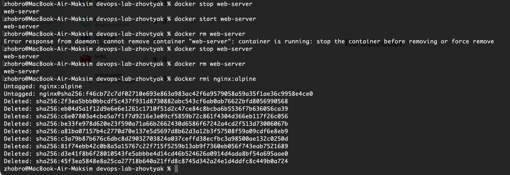
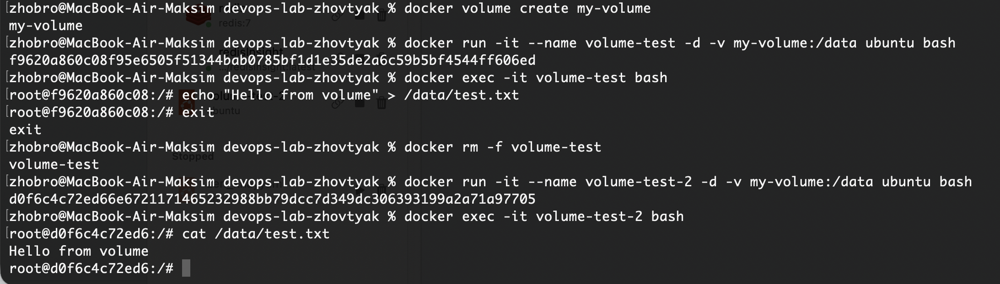

# Лабораторная работа №1 "Основы работы с Docker"

### 1. Устаналивается докер, проверяем версию, запускаем тестовый контейнер

  

### 2. Скачал образ Ubuntu (docker pull ubuntu:latest), запустил интерактивный контейнер (docker run -it ubuntu bash), внутри контейнера обновил список пакетов и установил curl (apt update && apt install -y curl), проверил установку командой curl --version и вышел из контейнера командой exit.

  

  

### 3. Запустил контейнер с Nginx (docker run -d -p 8081:80 --name web-server nginx:alpine), проверил его работу в браузере по адресу http://localhost:8080, посмотрел логи контейнера командой docker logs web-server и подключился к контейнеру через docker exec -it web-server sh.

  

  

  

### 4. Посмотрел запущенные контейнеры (docker ps), затем все контейнеры (docker ps -a), остановил контейнер (docker stop web-server), снова запустил его (docker start web-server), после этого удалил контейнер (docker rm web-server) и удалил образ (docker rmi nginx:alpine).

  

  

  

### 5. Cоздал том (docker volume create my-volume), запустил контейнер с подключенным томом (docker run -it --name volume-test -d -v my-volume:/data ubuntu bash), подключился к контейнеру (docker exec -it volume-test bash), создал файл в томе (echo "Hello from volume" > /data/test.txt), затем удалил контейнер, создал новый контейнер с тем же томом и проверил, что файл сохранился.

  

