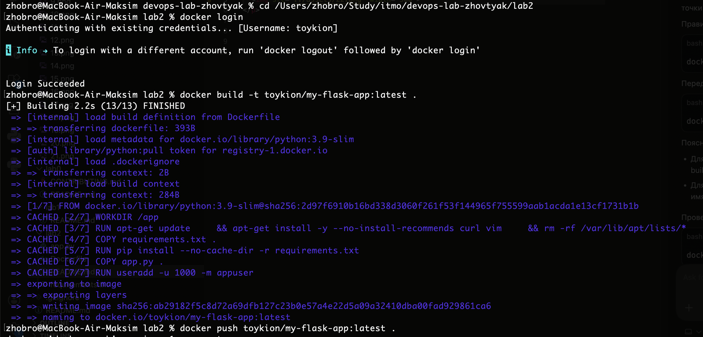
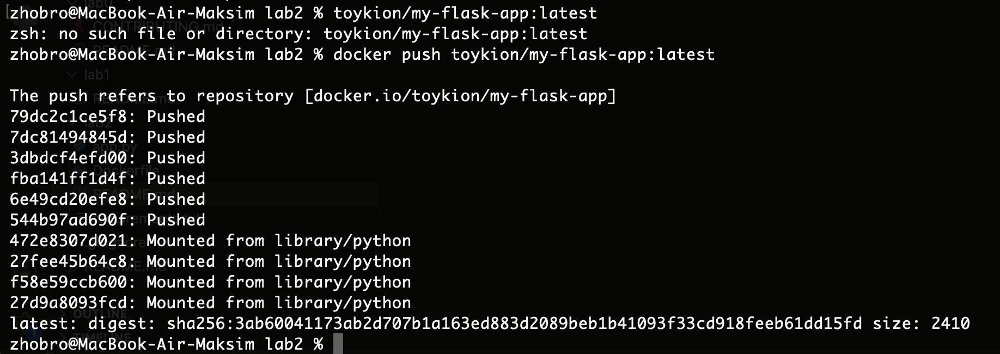
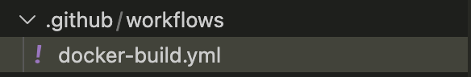
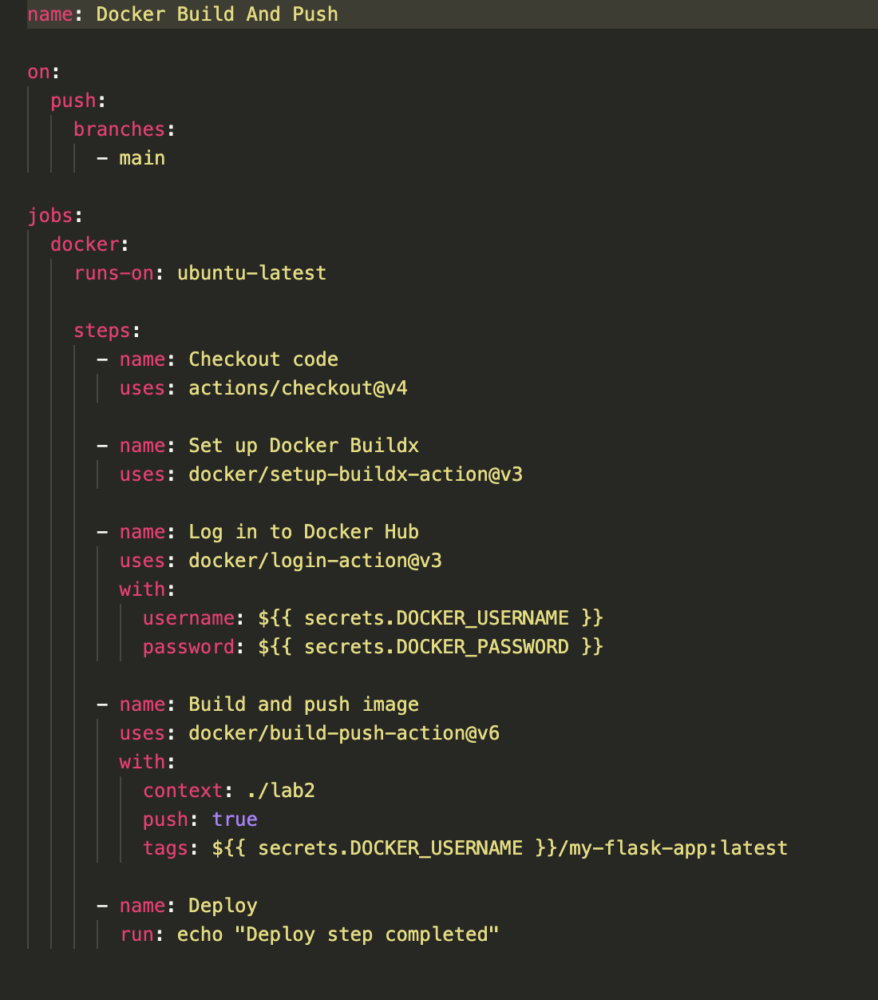
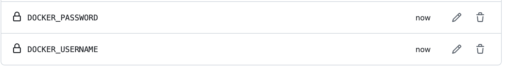

# Лабораторная работа №2 "CI/CD для Docker приложения"

### 1. Подготовил проект: скопировал файлы из первой лабораторной (app.py, requirements.txt, Dockerfile) в новый репозиторий, создал аккаунт на Docker Hub и добавил там репозиторий для хранения Docker-образа.

  

  

### 2. Настроил GitHub Actions: создал папку .github/workflows и файл docker-build.yml, в котором настроил пайплайн, запускающийся при push в ветку main, использующий Ubuntu runner, выполняющий checkout кода, настройку Docker Buildx, авторизацию в Docker Hub через секреты, сборку и публикацию Docker-образа с тегом toykion/my-flask-app:latest, а также добавил шаг деплоя с выводом сообщения.

  

  

### 3. Настроил секреты в репозитории GitHub, добавив переменные DOCKER_USERNAME и DOCKER_PASSWORD для авторизации при публикации Docker-образа.

  

### 3. Протестировал пайплайн: сделал commit и push в ветку main, проверил выполнение в разделе Actions, убедился, что Docker-образ появился в Docker Hub, и просмотрел логи выполнения каждого шага.

  

