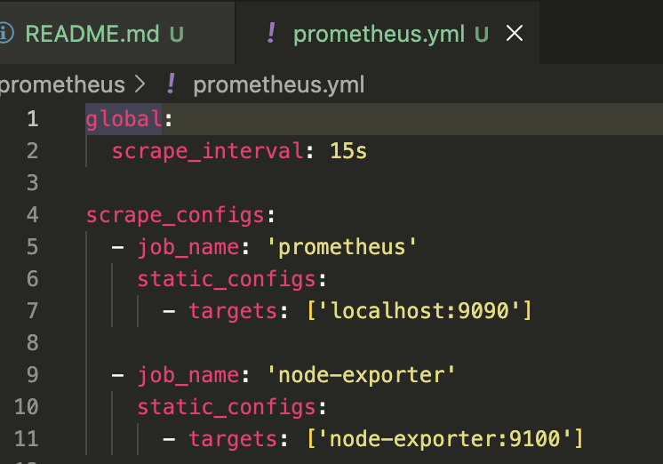
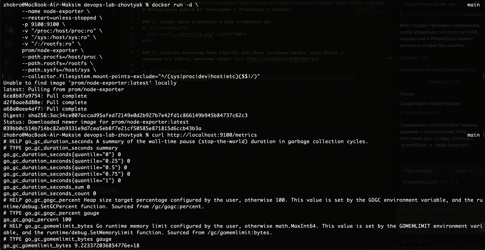
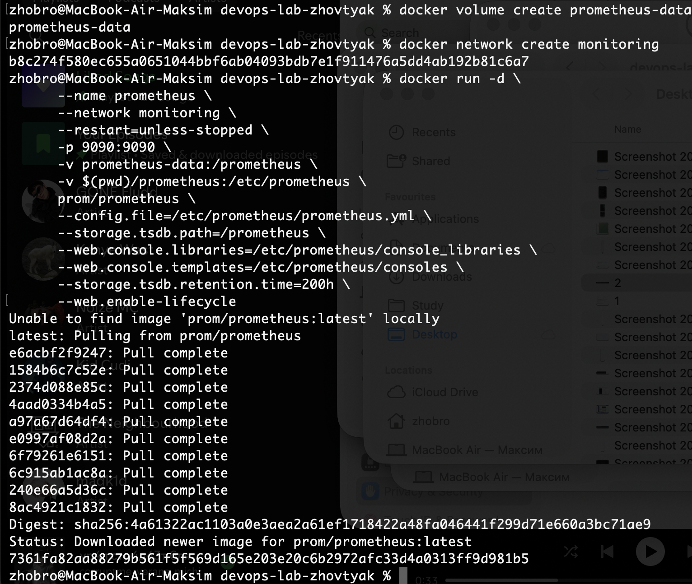
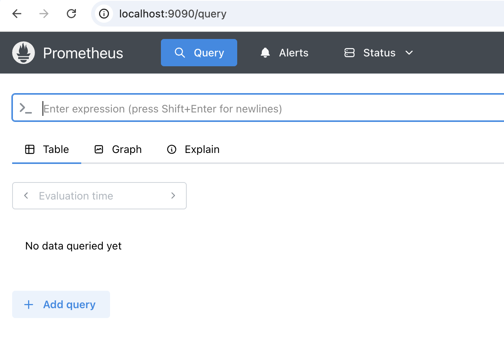
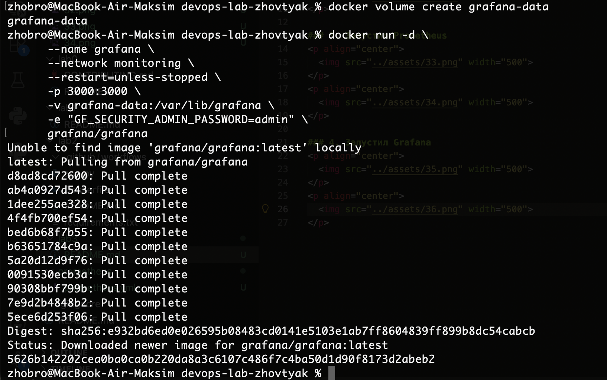
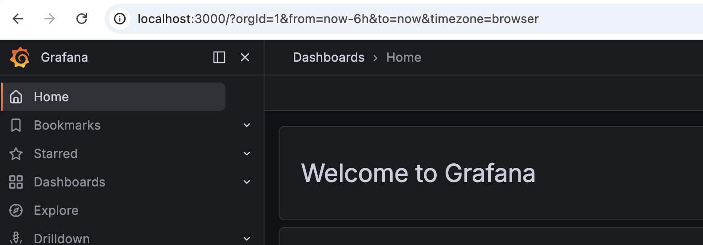
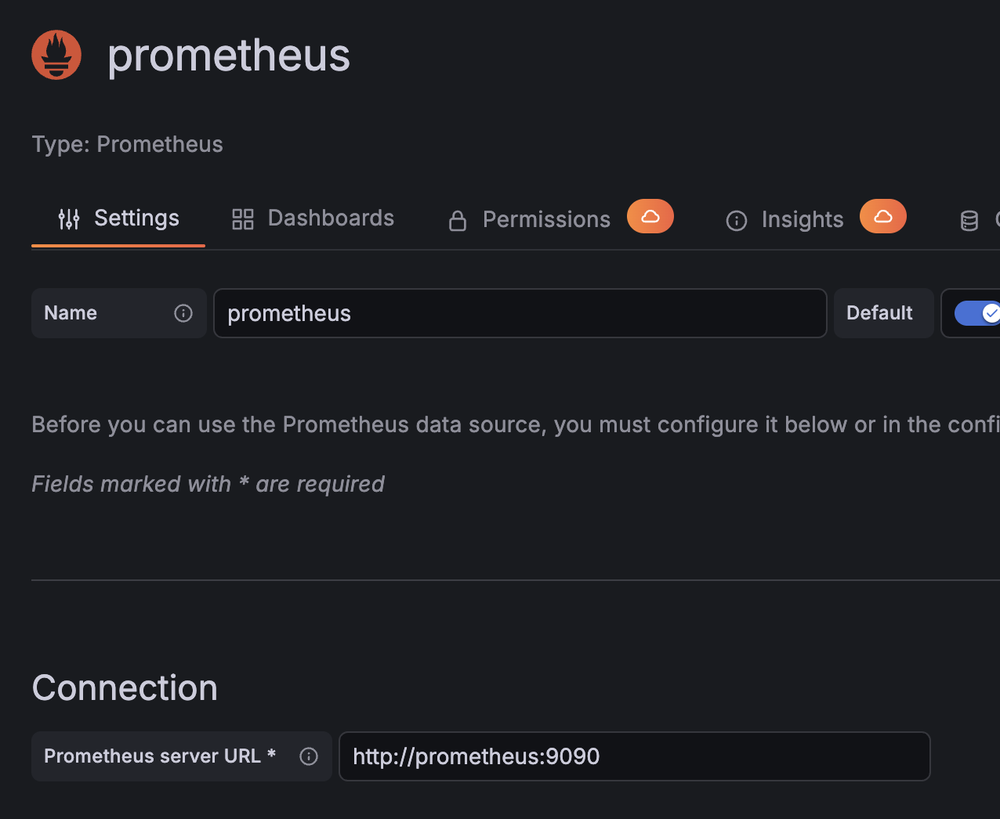
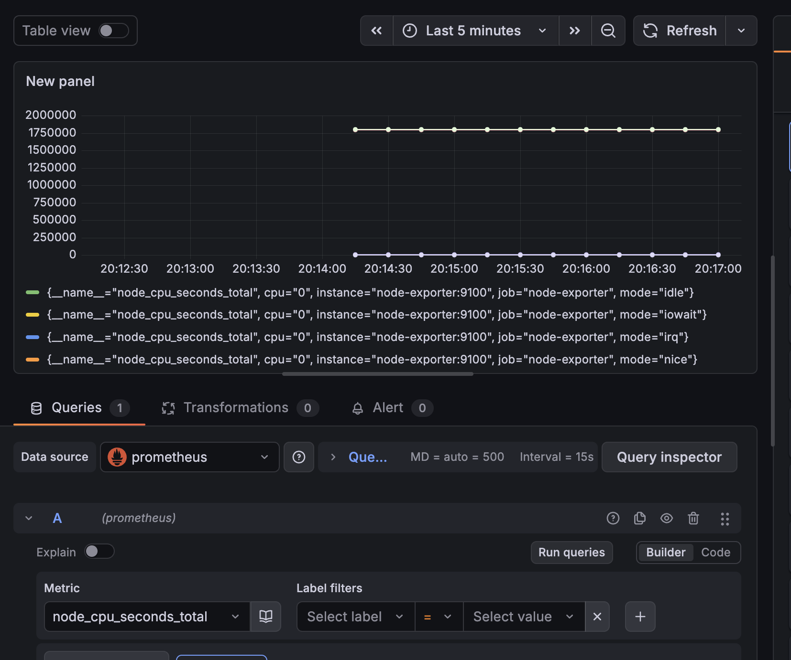
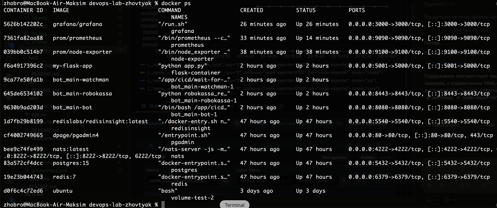
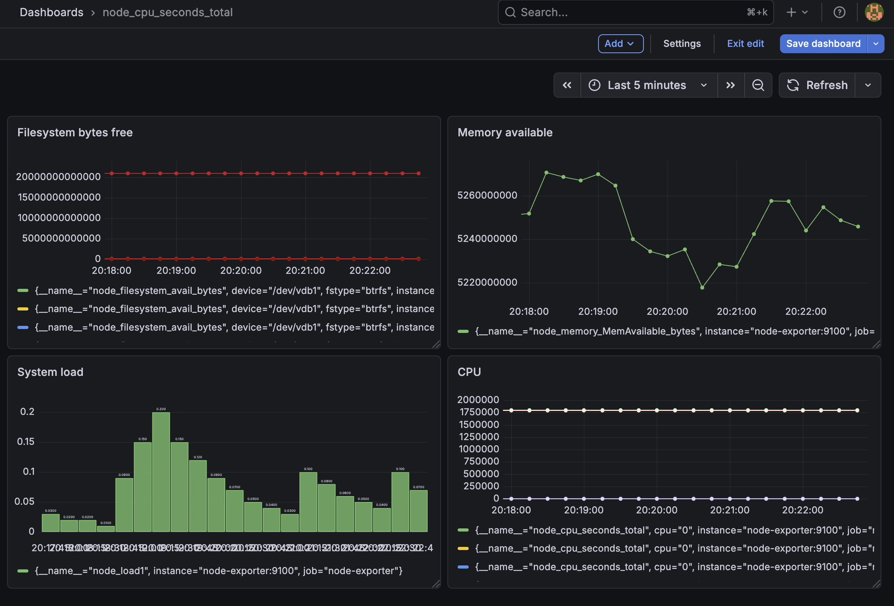

# Лабораторная работа №3 "Мониторинг с Prometheus и Grafana"

### 1. Создал папку prometheus и файл prometheus.yml

  

### 2. Запустил контейнер Node Exporter для сбора системных метрик через Docker и проверил его работу, выполнив запрос curl http://localhost:9100/metrics.

  

### 3. Запустил Prometheus

  

  

### 4. Запустил Grafana

  

  

### 5. Настроил Grafana: добавил источник данных Prometheus и создал дашборд с визуализацией метрики node_cpu_seconds_total.

  

  

### 6. Проверил запущенные контейнеры через docker ps, убедился в сборе метрик в Prometheus и проверил отображение графиков в Grafana, добавив графики для CPU, памяти и диска.

  

  

