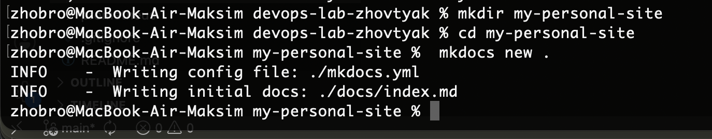
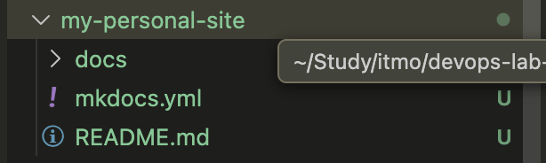
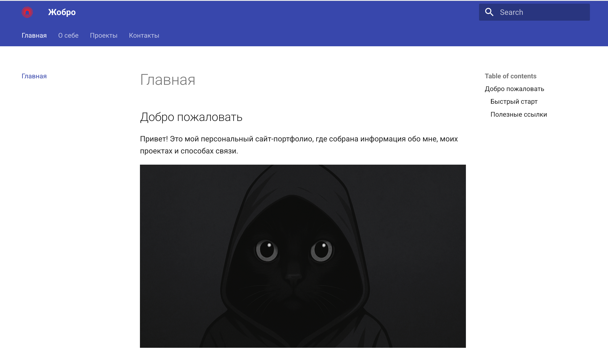
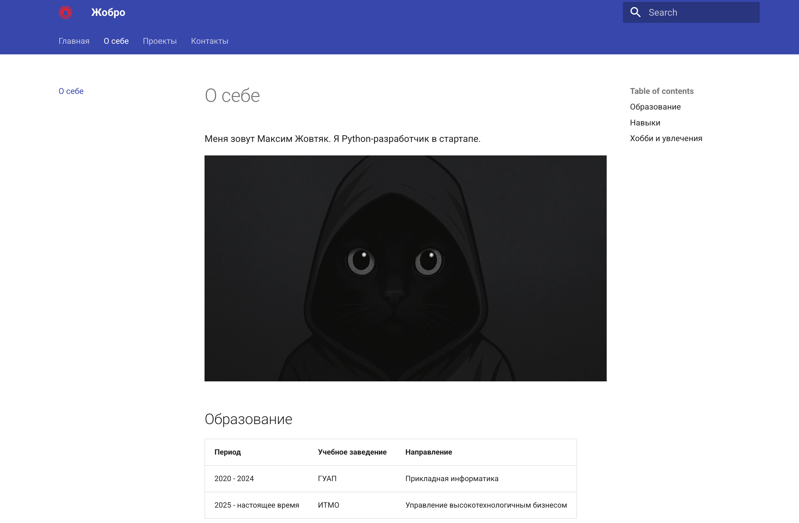
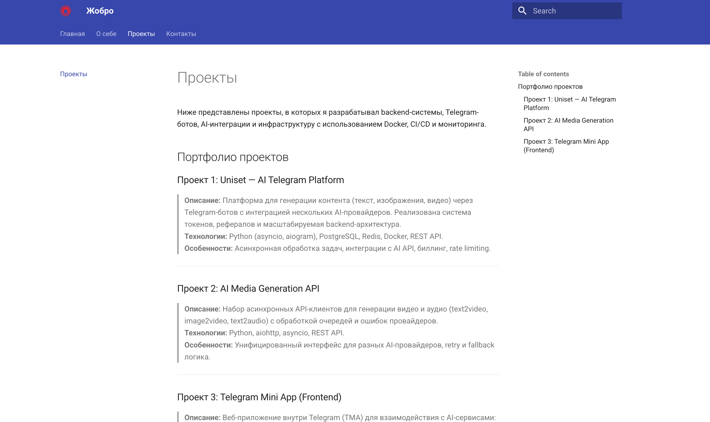
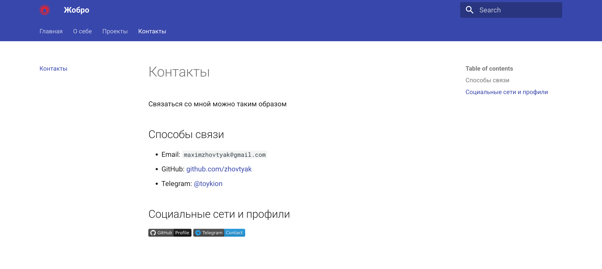
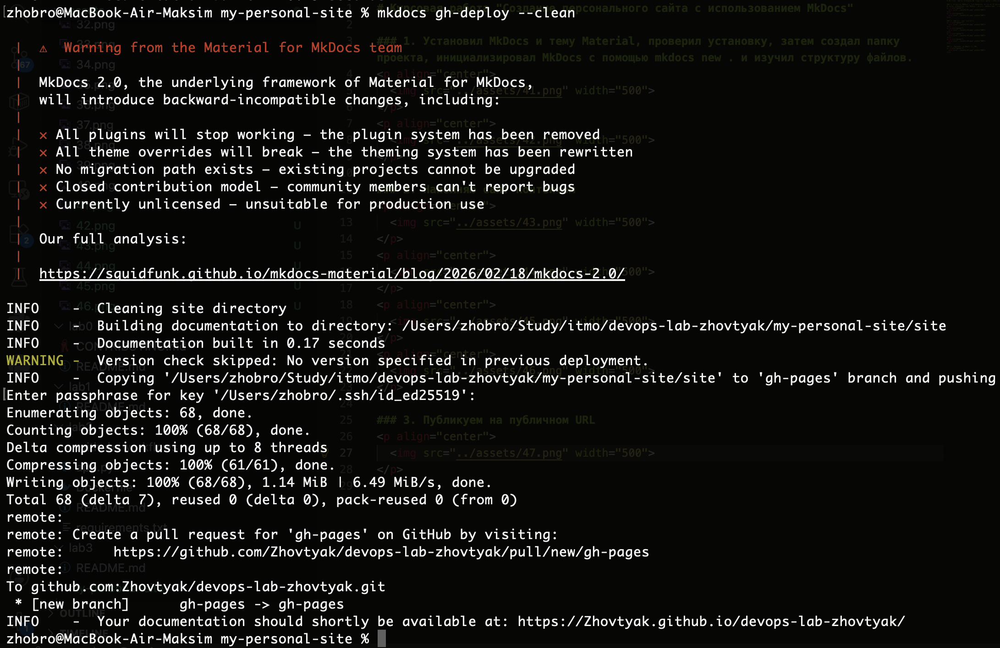

# Курсовая работа "Создание персонального сайта с использованием MkDocs"

URL САЙТА: https://zhovtyak.github.io/devops-lab-zhovtyak/

### 1. Установил MkDocs и тему Material, проверил установку, затем создал папку проекта, инициализировал MkDocs с помощью mkdocs new . и изучил структуру файлов.

  

  

### 2. Наполняю сайт контентом

  

  

  

  

### 3. Публикуем на публичном URL

  

